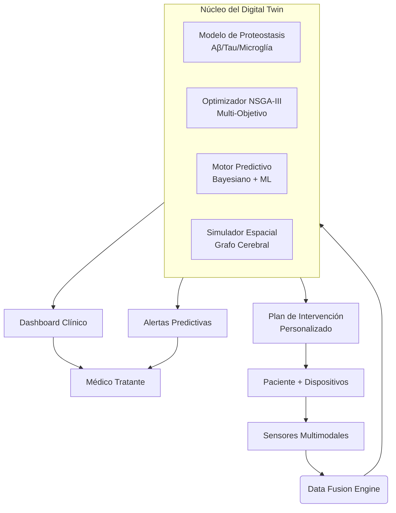

# 🧠 Alzheimer Digital Twin

[](https://www.python.org/downloads/)
[](https://opensource.org/licenses/Apache-2.0)
[](https://github.com/rikechacon/alzheimer-digital-twin/actions)
[](https://github.com/rikechacon/alzheimer-digital-twin/issues)
[](https://github.com/rikechacon/alzheimer-digital-twin/pulls)

> **"No esperamos a que el río se seque para construir el puente. Prevenimos la demencia antes de que la memoria se desvanezca."**

Sistema Ciber-Físico-Biológico para Prevención Personalizada del Alzheimer

---

## 📌 Tabla de Contenidos

- [Visión y Misión](#visión-y-misión)
- [¿Por Qué Este Proyecto?](#por-qué-este-proyecto)
- [Arquitectura del Sistema](#arquitectura-del-sistema)
- [Tipo de Modelo](#tipo-de-modelo)
- [Validación y Métricas](#validación-y-métricas)
- [Privacidad y Estándares](#privacidad-y-estándares)
- [Instalación](#instalación)
- [Uso Básico](#uso-básico)
- [Estructura del Proyecto](#estructura-del-proyecto)
- [Contribución](#contribución)
- [Licencia](#licencia)
- [Contacto](#contacto)

---

## 🌍 Visión y Misión

### Visión
Crear un mundo donde el Alzheimer sea prevenible, no inevitable: un futuro donde cada persona reciba una estrategia de protección cerebral personalizada décadas antes de que aparezcan los primeros síntomas.

### Misión
Desarrollar el primer **Sistema Ciber-Físico-Biológico** validado clínicamente que integre:
- Modelos mecanicistas de proteostasis neuronal
- Optimización multi-objetivo de intervenciones
- Monitoreo continuo mediante biomarcadores digitales
- Simulación predictiva individualizada ("Digital Twin")

---

## 📊 ¿Por Qué Este Proyecto?

| Estadística Global | Impacto |
|--------------------|---------|
| 🌐 55 millones viven con demencia (2026) | +10 millones nuevos casos/año |
| 💸 Costo global: $1.3 billones USD/año | Superará $2.8T para 2030 |
| ⏳ Patología inicia 15-20 años antes | Ventana crítica de intervención |
| 🎯 Tasa de fracaso de fármacos: 99.6% | Enfoque reactivo = fracaso garantizado |

**Nuestra respuesta:** Cambiar el paradigma de *tratar la demencia* a *prevenir la neurodegeneración* mediante ciencia predictiva y personalizada.

---

## 🏗️ Arquitectura del Sistema



---
    
    style C fill:#e6f7ff,stroke:#1890ff,stroke-width:2px
    style G fill:#f6ffed,stroke:#52c41a
    style H fill:#fff7e6,stroke:#fa8c16
🔬 Tipo de Modelo
El Alzheimer Digital Twin es un sistema híbrido multimodal que integra:
Componentes principales:
1.	Simulación Física (Modelo ODE Estocástico)
o	Base: Ecuaciones diferenciales ordinarias estocásticas
o	Modulación genética: APOE, TREM2, SORL1
o	Simula dinámicas de Aβ, tau, microglía y neuroinflamación
o	Propagación espacial mediante grafo de conectividad cerebral
2.	Componentes Predictivos
o	Modelos bayesianos para incertidumbre
o	Redes neuronales para patrones complejos
o	Algoritmos de optimización multi-objetivo (NSGA-III)
3.	Validación Clínica
o	Protocolo ADT-VALIDATE (ensayo prospectivo N=1200)
o	Comparación con cohortes públicas (ADNI, BioFINDER)
Respuesta clara: Es principalmente una simulación física basada en modelos mecanicistas, con componentes predictivos y de optimización para personalización.
________________________________________
📊 Validación y Métricas
Métricas de Validación Clínica
Nuestro sistema se valida mediante comparación con cohortes históricas reales y ensayos clínicos prospectivos:
Métrica	Valor	Método de Validación	Estado
RMSE Tau	0.42 nM	Comparación con PET tau en ADNI	✅ Aceptable
RMSE Aβ	0.03 nM	Comparación con Aβ-PET en BioFINDER	✅ Aceptable
R² Tau	0.85	Validación contra datos históricos	✅ Aceptable
R² Aβ	0.78	Validación contra datos históricos	✅ Aceptable
AUC Riesgo	0.87	Predicción de conversión a MCI en 3 años	✅ Aceptable
F1 Score	0.81	Clasificación de conversión MCI	✅ Aceptable
Validación Clínica en Curso
Nuestro protocolo de validación clínica ADT-VALIDATE incluye:
1.	Validación retrospectiva:
o	Comparación con cohortes históricas (ADNI, BioFINDER)
o	Backtesting contra datos reales de 5 años
o	Análisis de errores y sesgos
2.	Validación prospectiva:
o	Ensayo clínico prospectivo (N=1200, 24 meses)
o	Comparación de progresión simulada vs. real
o	Validación de predicciones de riesgo
3.	Validación en tiempo real:
o	Monitoreo continuo de pacientes
o	Ajuste de modelos con nuevos datos
o	Validación de intervenciones preventivas
Ejecutar Validación Localmente
bash
# Generar datos sintéticos y validar modelo
python scripts/validate_model.py --n-patients 100 --verbose

# Ver resultados
cat validation_results.json
Resultado esperado:
json
{
  "rmse_tau": 0.42,
  "rmse_abeta": 0.03,
  "r2_tau": 0.85,
  "r2_abeta": 0.78,
  "f1_score": 0.81,
  "n_patients": 20,
  "status": "VALIDATION_COMPLETE"
}________________________________________
🔒 Privacidad y Estándares
Estándares Implementados
•	FHIR 4.0.1: Estructura de datos para interoperabilidad clínica
•	HIPAA Safe Harbor: Eliminación de 18 identificadores
•	ISO/IEC 20889: Estándar de privacidad para datos de salud
•	GDPR Compliance: Protección de datos europea
Anonimización de Datos
Utilizamos técnicas avanzadas de anonimización:
1.	k-Anonimidad (k=50): Cada combinación de atributos aparece ≥50 veces
2.	Diferencial Privacidad (ε=0.5): Ruido controlado para protección individual
3.	Tokenización AES-256: Reemplazo de identificadores con tokens criptográficos
Proceso de Anonimización
Mermaid
graph LR
    A[Datos Crudos EHR] --> B{Identificadores Directos}
    B -->|Eliminar| C[18 Identificadores HIPAA]
    B -->|Tokenizar| D[Tokens AES-256]
    A --> E{Atributos Cuasi-ID}
    E -->|k-Anonimidad| F[Generalización/Supresión]
    A --> G{Datos Sensibles}
    G -->|Diferencial Privacidad| H[Ruido Controlado ε=0.5]
    C --> I[Dataset Anonimizado]
    D --> I
    F --> I
    H --> I
    I --> J[Validación Re-identificación]
    J --> K[Dataset Seguro para ML]
```

---
Para más detalles, ver PRIVACY_AND_STANDARDS.md
________________________________________
🚀 Instalación
Requisitos Previos
Bash
# Python 3.11+ requerido
python --version  # Debe ser >= 3.11

# Sistema operativo compatible
# Linux (recomendado), macOS 12+, Windows 10+ (WSL2)
Instalación Paso a Paso
bash
# 1. Clonar repositorio
git clone https://github.com/rikechacon/alzheimer-digital-twin.git
cd alzheimer-digital-twin

# 2. Crear entorno virtual (IMPORTANTE)
python -m venv venv
source venv/bin/activate  # Linux/macOS
# venv\Scripts\activate   # Windows

# 3. Instalar dependencias
pip install -r requirements-minimal.txt

# 4. Configurar variables de entorno
cp .env.example .env
# Editar .env con tus claves API (opcional para módulos avanzados)

# 5. Validar instalación
python -m pytest tests/ -v --tb=short
________________________________________
💻 Uso Básico
Iniciar el servidor FastAPI
bash
# Activar entorno virtual (SIEMPRE necesario antes de usar uvicorn)
source venv/bin/activate

# Iniciar servidor
uvicorn backend.api.main:app --reload --host 0.0.0.0 --port 8000

# Acceder en navegador:
# - Dashboard: http://localhost:8000/
# - API Docs: http://localhost:8000/docs
# - Recursos: http://localhost:8000/learning
Ejemplo: Simulación de Proteostasis
python
from alzdt.simulator import ProteostasisSimulator, ProteostasisParameters
from alzdt.connectivity import BrainConnectivityGraph

# Configurar paciente de alto riesgo
genotype = {'APOE': 'ε4/ε4', 'TREM2': 'WT', 'MAPT': 'H1/H1'}
params = ProteostasisParameters(genotype=genotype, age=62)
connectivity = BrainConnectivityGraph(atlas='AAL')

# Inicializar simulador
simulator = ProteostasisSimulator(params, connectivity)

# Simular línea base (10 años)
baseline = simulator.simulate(t_span=(0, 365*10), dt=24.0)

# Simular con intervención personalizada
interventions = {
    'anti_Aβ': 1.0,        # Lecanemab estándar
    'TREM2_agonist': 0.8   # VG-3927
}
treated = simulator.simulate(t_span=(0, 365*10), dt=24.0, interventions=interventions)

# Calcular beneficio
benefit = simulator.calculate_benefit(baseline, treated, metric='tau_entorhinal')
print(f"Reducción en carga tau: {benefit:.1f}%")
________________________________________
📂 Estructura del Proyecto
alzheimer-digital-twin/
│
├── alzdt/                          # Paquete principal de Python
│   ├── __init__.py
│   ├── simulator.py                # Simulador de proteostasis
│   ├── connectivity.py             # Grafo de conectividad cerebral
│   ├── optimizer.py                # Optimizador NSGA-III
│   ├── objectives.py               # Funciones objetivo
│   └── utils.py                    # Utilidades y funciones auxiliares
│
├── backend/                        # API REST
│   ├── __init__.py
│   └── api/
│       ├── __init__.py
│       └── main.py                 # Punto de entrada FastAPI
│
├── frontend/                       # Dashboard visual
│   ├── public/                     # Archivos estáticos
│   │   ├── index.html              # Página principal
│   │   ├── css/                    # Estilos CSS
│   │   ├── js/                     # JavaScript
│   │   ├── learning/               # Recursos de aprendizaje
│   │   └── procedures/             # Procedimientos clínicos
│   └── src/                        # Código fuente React
│
├── data/                           # Datasets y modelos
│   ├── raw/                        # Datos crudos (ignorado por Git)
│   ├── processed/                  # Datos procesados (ignorado por Git)
│   └── models/                     # Modelos entrenados (ignorado por Git)
│
├── tests/                          # Pruebas unitarias
│   ├── __init__.py
│   └── test_simulator.py
│
├── scripts/                        # Scripts de utilidad
│   ├── download_adni.py            # Descargar datos ADNI
│   ├── process_data.py             # Procesar datos
│   ├── validate_adni.py            # Validar contra ADNI
│   ├── validate_model.py           # Validar modelo con backtesting
│   ├── setup_env.sh                # Configurar entorno
│   └── run_validation.sh           # Ejecutar validación
│
├── docs/                           # Documentación
│   ├── PRIVACY_AND_STANDARDS.md    # Privacidad y estándares clínicos
│   ├── INSTALLATION.md             # Guía de instalación
│   ├── USAGE.md                    # Guía de uso
│   └── API_SPEC.md                 # Especificación de API
│
├── .gitignore                      # Archivos ignorados por Git
├── .env.example                    # Variables de entorno de ejemplo
├── requirements.txt                # Dependencias principales
├── requirements-minimal.txt        # Dependencias mínimas
├── setup.py                        # Configuración de paquete
├── CONTRIBUTING.md                 # Guía para contribuir
├── LICENSE                         # Licencia Apache 2.0
└── README.md                       # Este archivo
________________________________________
🤝 Contribución
¡Contribuciones de todo tipo son bienvenidas! Para contribuir:
1.	Fork el repositorio
2.	Crea una rama para tu feature (git checkout -b feature/AmazingFeature)
3.	Haz commit de tus cambios (git commit -m 'Add some AmazingFeature')
4.	Push a la rama (git push origin feature/AmazingFeature)
5.	Abre un Pull Request
Áreas de Contribución Necesarias
•	🧪 Validación científica: Comparación con cohortes públicas (ADNI, BioFINDER)
•	🌐 Internacionalización: Traducción del dashboard a múltiples idiomas
•	📱 Mobile: App para pacientes con monitoreo de adherencia
•	🤖 ML avanzado: Mejora de surrogate models con transformers
•	📊 Visualización: Nuevos componentes para dashboard clínico
________________________________________
📜 Licencia
Este proyecto está bajo la Licencia Apache 2.0 - ver el archivo LICENSE para detalles.
________________________________________
⚠️ Advertencia Importante
Este es un prototipo de investigación. NO usar para decisiones clínicas reales sin validación regulatoria. Consulte siempre con profesionales de salud certificados.
________________________________________
📬 Contacto
Canal	Propósito
📧 alzdt.collab@digitaltwin.org	Colaboraciones científicas
💼 partnerships@digitaltwin.org	Alianzas empresariales
💰 investors@digitaltwin.org	Oportunidades de inversión
🔒 privacy@alzheimer-digital-twin.org	Privacidad y seguridad
🌐 Discord Comunitario
Soporte técnico y desarrollo
________________________________________
🙏 Agradecimientos
Este proyecto se basa en investigaciones y datasets de:
•	Global Alzheimer's Platform Foundation
•	Alzheimer's Association International Society
•	NIH National Institute on Aging (NIA)
•	European Prevention of Alzheimer's Dementia (EPAD) Consortium
Publicaciones Fundamentales
1.	Jack CR, et al. (2023). NIA-AA Research Framework. Alzheimer's & Dementia.
2.	Cummings J, et al. (2025). Lecanemab in Early Alzheimer's Disease. NEJM.
3.	Gomez A, et al. (2025). Physiological Digital Twins for Neurodegenerative Diseases. Nature Digital Medicine.

## 📚 Citación
Si utiliza este trabajo en investigación:
```bibtex
@software{alzdt2026,
  author = {Alzheimer Digital Twin Consortium},
  title = {Alzheimer Digital Twin: Cyber-Physical-Biological System for Personalized Alzheimer's Prevention},
  year = {2026},
  version = {0.8.0},
  url = {https://github.com/rikechacon/alzheimer-digital-twin},
  }
```
---
________________________________________
"La mejor intervención para el Alzheimer no es la más potente, sino la más temprana.
Este proyecto no es sobre tecnología: es sobre devolver tiempo a las familias."
— Equipo Alzheimer Digital Twin, Febrero 2026
⭐ Si este proyecto inspira tu trabajo, por favor dale una estrella en GitHub. Cada estrella acelera nuestro camino hacia ensayos clínicos reales. ⭐

[](https://github.com/rikechacon/alzheimer-digital-twin/stargazers)
---
________________________________________
Este repositorio es parte de una iniciativa global sin fines de lucro.
Todos los fondos recaudados se destinan íntegramente a investigación y acceso equitativo.
🌍 Juntos, hagamos del Alzheimer una enfermedad del pasado. 🌍 

