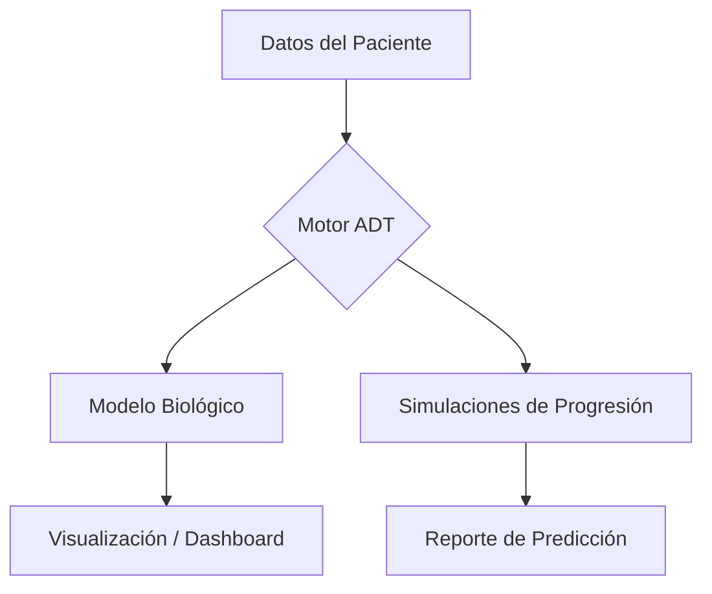

# Alzheimer Digital Twin (ADT) 🧠

Proyecto de Gemelo Digital para el modelado y predicción de la progresión del Alzheimer.

## 🏗️ Arquitectura del Sistema


## 📂 Estructura del Proyecto
* `src/`: Lógica principal del gemelo digital.
* `data/`: Almacenamiento de datasets (ignorado por Git).
* `notebooks/`: Experimentos y análisis exploratorio.
* `tests/`: Pruebas unitarias para validar los modelos.

## 🚀 Instalación
```bash
pip install -r requirements.txt
```
