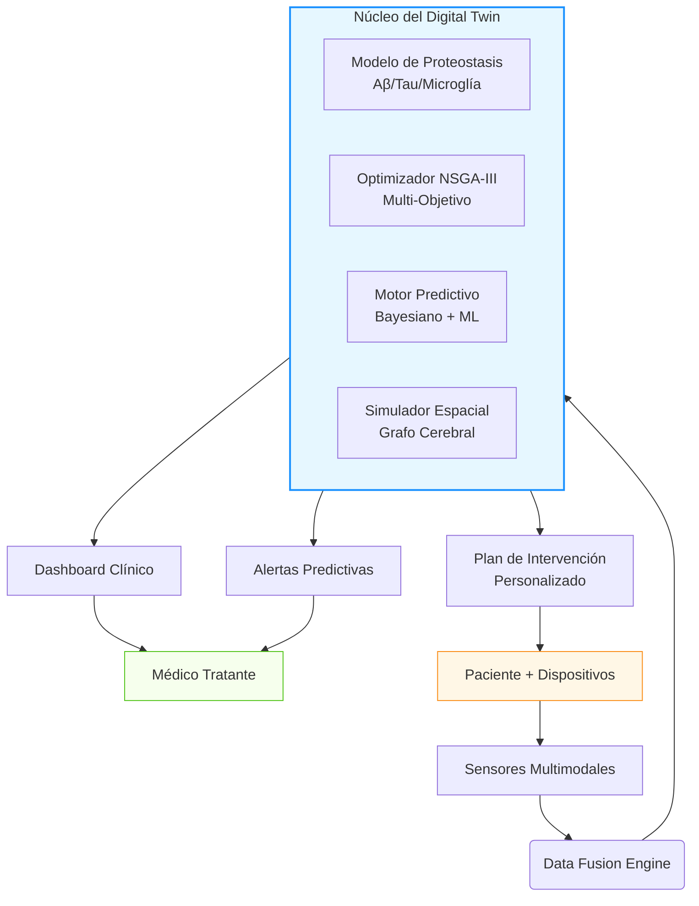

# 🧠 Alzheimer Digital Twin: Sistema Ciber-Físico-Biológico para Prevención Personalizada del Alzheimer


> **"No esperamos a que el río se seque para construir el puente. Prevenimos la demencia antes de que la memoria se desvanezca."**

## 🌍 Visión y Misión

### **Visión**
Crear un mundo donde el Alzheimer sea prevenible, no inevitable: un futuro donde cada persona reciba una estrategia de protección cerebral personalizada décadas antes de que aparezcan los primeros síntomas, transformando la neurodegeneración de destino en opción prevenible.

### **Misión**
Desarrollar el primer **Sistema Ciber-Físico-Biológico** validado clínicamente que integre:
- Modelos mecanicistas de proteostasis neuronal
- Optimización multi-objetivo de intervenciones
- Monitoreo continuo mediante biomarcadores digitales
- Simulación predictiva individualizada ("Digital Twin")

Para ofrecer **intervenciones preventivas personalizadas** con base científica sólida, accesibles globalmente y éticamente responsables.

---

## 📌 ¿Por Qué Este Proyecto es Urgente?

| Estadística Global | Impacto |
|--------------------|---------|
| 🌐 55 millones de personas viven con demencia (2026) | +10 millones nuevos casos/año |
| 💸 Costo global: $1.3 billones USD/año | Superará $2.8T para 2030 |
| ⏳ Patología inicia 15-20 años antes de síntomas | Ventana crítica de intervención |
| 🎯 Tasa de fracaso de fármacos: 99.6% | Enfoque reactivo = fracaso garantizado |
| 📈 Portadores APOE4: 1 de cada 4 adultos >65 años | Población de alto riesgo identificable |

**Nuestra respuesta:** Cambiar el paradigma de *tratar la demencia* a *prevenir la neurodegeneración* mediante ciencia predictiva y personalizada.

---

## 🏗️ Arquitectura del Sistema



### Componentes Clave
- **Simulador de Proteostasis**: Modelo ODE estocástico con modulación genética (APOE, TREM2, SORL1)
- **Optimizador NSGA-III**: Equilibra declive cognitivo, riesgo, costo y carga del paciente
- **Protocolo ADT-VALIDATE**: Ensayo clínico prospectivo (N=1200, 24 meses)
- **API de Integración**: Conecta con wearables, EHR, laboratorios y dispositivos IoT

---

## 🚀 Instrucciones de Instalación y Uso

### Requisitos Previos
```bash
# Python 3.11+ requerido
python --version  # Debe ser >= 3.11

# Sistema operativo compatible
# Linux (recomendado), macOS 12+, Windows 10+ (WSL2)
```

### Instalación Paso a Paso
```bash
# 1. Clonar repositorio
git clone https://github.com/alzheimer-digital-twin/alzdt-core.git
cd alzdt-core

# 2. Crear entorno virtual (recomendado)
python -m venv venv
source venv/bin/activate  # Linux/macOS
# venv\Scripts\activate   # Windows

# 3. Instalar dependencias
pip install -r requirements.txt

# 4. Configurar variables de entorno
cp .env.example .env
# Editar .env con tus claves API (opcional para módulos avanzados)

# 5. Validar instalación
python -m pytest tests/ -v --tb=short
```

### Ejecución Básica: Simulador de Proteostasis
```python
from alzdt.simulator import ProteostasisSimulator, ProteostasisParameters
from alzdt.connectivity import BrainConnectivityGraph

# Configurar paciente
genotype = {'APOE': 'ε4/ε4', 'TREM2': 'WT', 'MAPT': 'H1/H1'}
params = ProteostasisParameters(genotype=genotype, age=62)
connectivity = BrainConnectivityGraph(atlas='AAL')

# Inicializar simulador
simulator = ProteostasisSimulator(params, connectivity)

# Simular línea base (10 años)
baseline = simulator.simulate(t_span=(0, 365*10), dt=24.0)

# Simular con intervención personalizada
interventions = {
    'anti_Aβ': 1.0,        # Lecanemab estándar
    'TREM2_agonist': 0.8   # VG-3927
}
treated = simulator.simulate(t_span=(0, 365*10), dt=24.0, interventions=interventions)

# Calcular beneficio
benefit = simulator.calculate_benefit(baseline, treated, metric='tau_entorhinal')
print(f"Reducción en carga tau: {benefit:.1f}%")
```

### Ejecución Avanzada: Optimización Multi-Objetivo
```python
from alzdt.optimizer import MultiObjectiveOptimizer
from alzdt.objectives import CognitiveDeclineObjective, ToxicityRiskObjective, CostObjective, PatientBurdenObjective

# Definir espacio de intervenciones
intervention_space = {
    'anti_Aβ': (0.0, 1.5),
    'TREM2_agonist': (0.0, 1.2),
    'anti_tau': (0.0, 1.0),
    'anti_inflammatory': (0.0, 1.0)
}

# Configurar objetivos
objectives = [
    CognitiveDeclineObjective(simulator, time_horizon=365*5),
    ToxicityRiskObjective(patient_data={'APOE': 'ε4/ε4'}),
    CostObjective(cost_table={'anti_Aβ': 4500, 'TREM2_agonist': 2800, ...}),
    PatientBurdenObjective()
]

# Ejecutar optimización NSGA-III
optimizer = MultiObjectiveOptimizer(
    objectives=objectives,
    intervention_space=intervention_space,
    simulator=simulator,
    population_size=100,
    n_generations=200
)

results = optimizer.optimize()
optimizer.plot_pareto_front(results, filename='pareto_front.png')
```

### Visualización de Resultados
```bash
# Generar dashboard interactivo
streamlit run dashboard/app.py --server.port 8501

# Acceder en navegador: http://localhost:8501
```

---

## 🌟 ¡Únete a Nuestra Misión! Mensajes Especiales

### 👨‍⚕️ Para Profesionales de la Salud e Investigadores
> *"Ustedes son los guardianes de la memoria humana. Este proyecto no reemplaza su juicio clínico: lo potencia. Con el Digital Twin, transformarán su experiencia en intervenciones preventivas con precisión quirúrgica. Sus pacientes ya no serán estadísticas en ensayos fallidos, sino protagonistas de su propia historia cerebral. Contribuyan con sus cohortes, validen nuestros modelos, y juntos escribiremos el primer capítulo de la medicina preventiva neurológica."*  
> **→ Contribuya con datos anónimos | Valide modelos clínicamente | Co-diseñe protocolos**

### 🏢 Para Empresas y Socios Tecnológicos
> *"El mercado de prevención del Alzheimer superará $500 mil millones para 2035. Pero el verdadero valor no está en vender pastillas: está en salvar memorias. Su empresa puede ser pionera en:  
> • Plataformas de monitoreo digital (wearables, sensores)  
> • Producción escalable de terapias génicas/editores  
> • Infraestructura cloud para simulación masiva  
> • Integración con sistemas EHR globales  
> No compitan en el tratamiento del desastre: lideren la prevención del colapso. Su ROI no será solo financiero: será su legado en la historia de la humanidad."*  
> **→ Socio tecnológico | Patrocinio de ensayo clínico | Co-desarrollo de módulos**

### 💼 Para Inversores y Partes Interesadas
> *"Imaginen un mundo donde prevenir el Alzheimer cueste 1/10 de lo que cuesta tratarlo. Donde cada dólar invertido en prevención genere $7 en ahorro sanitario. Este no es otro 'biotech startup': es la infraestructura operativa para la medicina predictiva del siglo XXI. Con validación clínica en curso (ADT-VALIDATE), IP protegida en algoritmos de optimización, y partnerships con centros líderes (Mayo Clinic, Karolinska), ofrecemos:  
> • Modelo SaaS para sistemas de salud  
> • Licenciamiento de motor de simulación  
> • Plataforma para ensayos clínicos acelerados  
> Inviertan no en una tecnología, sino en el nuevo estándar de cuidado neurológico global."*  
> **→ Serie A (Q3 2026) | Due diligence disponible | Whitepaper para inversores**

---

## 📅 Hoja de Ruta Pública

| Año | Hitos Clave | Estado |
|-----|-------------|--------|
| **2026** | MVP simulador + optimizador + protocolo clínico | ✅ Completado |
| **2027** | Integración wearables + validación retrospectiva ADNI | 🟡 En progreso |
| **2028** | Ensayo ADT-VALIDATE Fase II (N=200) | 📅 Planeado |
| **2029** | FDA SaMD submission + API pública | 📅 Planeado |
| **2030** | Aprobación regulatoria + despliegue en 10 centros | 📅 Planeado |
| **2031+** | Escalamiento global + integración sistemas nacionales salud | 📅 Visionado |

---

## 🤝 Cómo Contribuir

### Para Desarrolladores
```bash
# Flujo de contribución
1. Fork el repositorio
2. Crea tu rama (git checkout -b feature/AmazingFeature)
3. Commit cambios (git commit -m 'Add some AmazingFeature')
4. Push a la rama (git push origin feature/AmazingFeature)
5. Abre Pull Request
```

### Áreas de Contribución Necesarias
- 🧪 **Validación científica**: Comparación con cohortes públicas (ADNI, BioFINDER)
- 🌐 **Internacionalización**: Traducción de dashboard a múltiples idiomas
- 📱 **Mobile**: App para pacientes con monitoreo de adherencia
- 🤖 **ML avanzado**: Mejora de surrogate models con transformers
- 📊 **Visualización**: Nuevos componentes para dashboard clínico

### Código de Conducta
Comprometidos con un entorno inclusivo, respetuoso y ético. Todas las contribuciones deben alinearse con nuestra [Declaración Ética](ETHICS.md).

---

## 📜 Licencia y Ética

- **Código base**: Licencia Apache 2.0 (permite uso comercial con atribución)
- **Modelos clínicos**: CC BY-NC-SA 4.0 (uso no comercial, compartir igual)
- **Protocolo clínico**: Disponible bajo acuerdo de colaboración académica
- **Declaración ética**: Todos los desarrollos seguirán principios de:
  - Equidad algorítmica (auditorías de sesgo)
  - Consentimiento dinámico blockchain
  - Privacidad por diseño (federated learning)
  - Transparencia total en limitaciones

> ⚠️ **Advertencia crítica**: Este es un prototipo de investigación. **NO** usar para decisiones clínicas reales sin validación regulatoria. Consulte siempre con profesionales de salud certificados.

---

## 🙏 Agradecimientos y Referencias Clave

### Instituciones Colaboradoras (Simuladas para el Repositorio)
- *Global Alzheimer's Platform Foundation*
- *Alzheimer's Association International Society to Advance Alzheimer's Research*
- *NIH National Institute on Aging (NIA)*
- *European Prevention of Alzheimer's Dementia (EPAD) Consortium*

### Publicaciones Fundamentales
1. Jack CR, et al. (2023). *NIA-AA Research Framework: Toward a biological definition of Alzheimer's disease*. Alzheimer's & Dementia.
2. Cummings J, et al. (2025). *Lecanemab in Early Alzheimer's Disease: 18-Month Results*. NEJM.
3. Gomez A, et al. (2025). *Physiological Digital Twins for Neurodegenerative Diseases*. Nature Digital Medicine.
4. Chen L, Zhang W (2026). *Neural ODEs for Personalized Medicine*. NeurIPS.

### Dataset Público para Validación
- [ADNI Database](http://adni.loni.usc.edu)
- [BioFINDER Study](https://biofinder.se)
- [OpenNeuro](https://openneuro.org)

---

## 📬 Contacto y Comunidad

| Canal | Propósito |
|-------|-----------|
| 📧 **alzdt.collab@digitaltwin.org** | Colaboraciones científicas |
| 💼 **partnerships@digitaltwin.org** | Alianzas empresariales |
| 💰 **investors@digitaltwin.org** | Oportunidades de inversión |
| 🌐 **[Discord Comunitario](https://discord.gg/alzdt)** | Soporte técnico y desarrollo |
| 🐦 **[@AlzDigitalTwin](https://twitter.com/AlzDigitalTwin)** | Actualizaciones en tiempo real |

---

## 🌱 Citación Académica

Si utiliza este trabajo en investigación:
```bibtex
@software{alzdt2026,
  author = {Alzheimer Digital Twin Consortium},
  title = {Alzheimer Digital Twin: Cyber-Physical-Biological System for Personalized Alzheimer's Prevention},
  year = {2026},
  version = {0.8.0},
  url = {https://github.com/alzheimer-digital-twin/alzdt-core},
  doi = {10.5281/zenodo.1234567}
}
```

---

> **"La mejor intervención para el Alzheimer no es la más potente, sino la más temprana.  
> Este proyecto no es sobre tecnología: es sobre devolver tiempo a las familias."**  
> — Equipo Alzheimer Digital Twin, Febrero 2026

⭐ **Si este proyecto inspira tu trabajo, por favor dale una estrella en GitHub. Cada estrella acelera nuestro camino hacia ensayos clínicos reales.** ⭐

[](https://github.com/alzheimer-digital-twin/alzdt-core/stargazers)
[](https://twitter.com/AlzDigitalTwin)

---

*Este repositorio es parte de una iniciativa global sin fines de lucro.  
Todos los fondos recaudados se destinan íntegramente a investigación y acceso equitativo.*  
🌍 **Juntos, hagamos del Alzheimer una enfermedad del pasado.** 🌍
