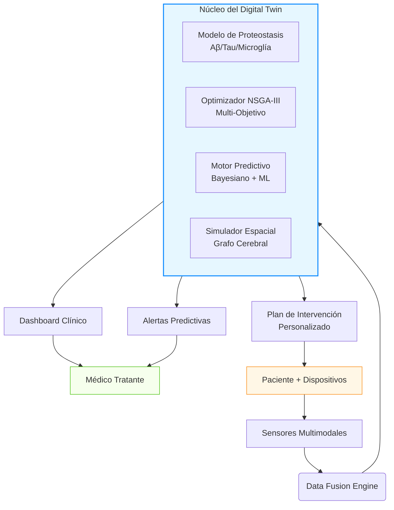

# 🧠 Alzheimer Digital Twin

[](https://www.python.org/downloads/)
[](https://opensource.org/licenses/Apache-2.0)
[](https://github.com/rikechacon/alzheimer-digital-twin/actions)
[](https://github.com/rikechacon/alzheimer-digital-twin/issues)
[](https://github.com/rikechacon/alzheimer-digital-twin/pulls)

> **"No esperamos a que el río se seque para construir el puente. Prevenimos la demencia antes de que la memoria se desvanezca."**

Sistema Ciber-Físico-Biológico para Prevención Personalizada del Alzheimer

---

## 📌 Tabla de Contenidos

- [Visión y Misión](#visión-y-misión)
- [¿Por Qué Este Proyecto?](#por-qué-este-proyecto)
- [Características Principales](#características-principales)
- [Arquitectura del Sistema](#arquitectura-del-sistema)
- [Instalación](#instalación)
- [Uso Básico](#uso-básico)
- [Estructura del Proyecto](#estructura-del-proyecto)
- [Contribución](#contribución)
- [Licencia](#licencia)
- [Contacto](#contacto)

---

## 🌍 Visión y Misión

### Visión
Crear un mundo donde el Alzheimer sea prevenible, no inevitable: un futuro donde cada persona reciba una estrategia de protección cerebral personalizada décadas antes de que aparezcan los primeros síntomas.

### Misión
Desarrollar el primer **Sistema Ciber-Físico-Biológico** validado clínicamente que integre:
- Modelos mecanicistas de proteostasis neuronal
- Optimización multi-objetivo de intervenciones
- Monitoreo continuo mediante biomarcadores digitales
- Simulación predictiva individualizada ("Digital Twin")

Para ofrecer **intervenciones preventivas personalizadas** con base científica sólida, accesibles globalmente y éticamente responsables.

---

## 📊 ¿Por Qué Este Proyecto?

| Estadística Global | Impacto |
|--------------------|---------|
| 🌐 55 millones viven con demencia (2026) | +10 millones nuevos casos/año |
| 💸 Costo global: $1.3 billones USD/año | Superará $2.8T para 2030 |
| ⏳ Patología inicia 15-20 años antes | Ventana crítica de intervención |
| 🎯 Tasa de fracaso de fármacos: 99.6% | Enfoque reactivo = fracaso garantizado |

**Nuestra respuesta:** Cambiar el paradigma de *tratar la demencia* a *prevenir la neurodegeneración* mediante ciencia predictiva y personalizada.

---

## ✨ Características Principales

### 🧪 Simulador de Proteostasis
- Modelo ODE estocástico con modulación genética (APOE, TREM2, SORL1)
- Simulación de dinámicas Aβ, tau, microglía y neuroinflamación
- Propagación espacial mediante grafo de conectividad cerebral

### 🎯 Optimizador Multi-Objetivo
- Algoritmo NSGA-III para equilibrar múltiples objetivos:
  - Minimizar declive cognitivo
  - Minimizar riesgo de toxicidad (ARIA)
  - Minimizar costo económico
  - Minimizar carga del paciente

### 📊 Dashboard Clínico Visual
- Interfaz web interactiva con gráficos en tiempo real
- Formularios para configuración de pacientes e intervenciones
- Visualización de resultados de simulación y optimización

### 🔬 API REST Completa
- Endpoints para simulación, optimización y evaluación de riesgo
- Documentación Swagger interactiva
- Integración con wearables, EHR y dispositivos IoT

### 📚 Recursos de Aprendizaje
- Tutoriales paso a paso
- Documentación técnica completa
- Protocolo clínico ADT-VALIDATE

---

## 🏗️ Arquitectura del Sistema



---

## 🚀 Instalación

### Requisitos Previos

```bash
# Python 3.11+ requerido
python --version  # Debe ser >= 3.11

# Sistema operativo compatible
# Linux (recomendado), macOS 12+, Windows 10+ (WSL2)
```

### Instalación Paso a Paso

```bash
# 1. Clonar repositorio
git clone https://github.com/rikechacon/alzheimer-digital-twin.git
cd alzheimer-digital-twin

# 2. Crear entorno virtual
python -m venv venv
source venv/bin/activate  # Linux/macOS
# venv\Scripts\activate   # Windows

# 3. Instalar dependencias
pip install -r requirements-minimal.txt

# 4. Configurar variables de entorno
cp .env.example .env
# Editar .env con tus claves API (opcional para módulos avanzados)

# 5. Validar instalación
python -m pytest tests/ -v --tb=short
```

---

## 💻 Uso Básico

### Ejemplo 1: Simulación de Proteostasis

```python
from alzdt.simulator import ProteostasisSimulator, ProteostasisParameters
from alzdt.connectivity import BrainConnectivityGraph

# Configurar paciente de alto riesgo
genotype = {'APOE': 'ε4/ε4', 'TREM2': 'WT', 'MAPT': 'H1/H1'}
params = ProteostasisParameters(genotype=genotype, age=62)
connectivity = BrainConnectivityGraph(atlas='AAL')

# Inicializar simulador
simulator = ProteostasisSimulator(params, connectivity)

# Simular línea base (10 años)
baseline = simulator.simulate(t_span=(0, 365*10), dt=24.0)

# Simular con intervención personalizada
interventions = {
    'anti_Aβ': 1.0,        # Lecanemab estándar
    'TREM2_agonist': 0.8   # VG-3927
}
treated = simulator.simulate(t_span=(0, 365*10), dt=24.0, interventions=interventions)

# Calcular beneficio
benefit = simulator.calculate_benefit(baseline, treated, metric='tau_entorhinal')
print(f"Reducción en carga tau: {benefit:.1f}%")
```

### Ejemplo 2: Optimización Multi-Objetivo

```python
from alzdt.optimizer import MultiObjectiveOptimizer
from alzdt.objectives import (
    CognitiveDeclineObjective,
    ToxicityRiskObjective,
    CostObjective,
    PatientBurdenObjective
)

# Definir espacio de intervenciones
intervention_space = {
    'anti_Aβ': (0.0, 1.5),
    'TREM2_agonist': (0.0, 1.2),
    'anti_tau': (0.0, 1.0),
    'anti_inflammatory': (0.0, 1.0)
}

# Configurar objetivos
objectives = [
    CognitiveDeclineObjective(simulator, time_horizon=365*5),
    ToxicityRiskObjective(patient_data={'APOE': 'ε4/ε4'}),
    CostObjective(cost_table={'anti_Aβ': 4500, 'TREM2_agonist': 2800}),
    PatientBurdenObjective()
]

# Ejecutar optimización NSGA-III
optimizer = MultiObjectiveOptimizer(
    objectives=objectives,
    intervention_space=intervention_space,
    simulator=simulator,
    population_size=100,
    n_generations=200
)
results = optimizer.optimize()

# Visualizar resultados
optimizer.plot_pareto_front(results, filename='pareto_front.png')
```

### Ejemplo 3: Iniciar Dashboard Clínico

```bash
# Iniciar servidor FastAPI
uvicorn backend.api.main:app --reload --host 0.0.0.0 --port 8000

# Acceder en navegador:
# - Dashboard: http://localhost:8000/
# - API Docs: http://localhost:8000/docs
# - Recursos: http://localhost:8000/learning
```

---

## 📂 Estructura del Proyecto

```
alzheimer-digital-twin/
│
├── alzdt/                          # Paquete principal de Python
│   ├── __init__.py
│   ├── simulator.py                # Simulador de proteostasis
│   ├── connectivity.py             # Grafo de conectividad cerebral
│   ├── optimizer.py                # Optimizador NSGA-III
│   ├── objectives.py               # Funciones objetivo
│   ├── utils.py                    # Utilidades y funciones auxiliares
│   └── models/                     # Modelos de machine learning
│       ├── physics_based/          # Modelos basados en física
│       ├── neural_ode/             # Neural ODEs
│       └── bayesian/               # Modelos bayesianos
│
├── backend/                        # API REST
│   ├── __init__.py
│   └── api/
│       ├── __init__.py
│       └── main.py                 # Punto de entrada FastAPI
│
├── frontend/                       # Dashboard visual
│   ├── public/                     # Archivos estáticos
│   │   ├── index.html              # Página principal
│   │   ├── css/                    # Estilos CSS
│   │   ├── js/                     # JavaScript
│   │   ├── learning/               # Recursos de aprendizaje
│   │   └── procedures/             # Procedimientos clínicos
│   ├── src/                        # Código fuente React
│   ├── package.json                # Dependencias npm
│   └── vite.config.ts              # Configuración Vite
│
├── data/                           # Datasets y modelos
│   ├── raw/                        # Datos crudos (ignorado por Git)
│   ├── processed/                  # Datos procesados (ignorado por Git)
│   ├── models/                     # Modelos entrenados (ignorado por Git)
│   └── notebooks/                  # Notebooks de análisis
│
├── notebooks/                      # Jupyter Notebooks
│   ├── 07_quickstart.ipynb         # Guía rápida de 5 minutos
│   ├── 01_proteostasis_simulation.ipynb
│   ├── 02_nsga3_optimization.ipynb
│   └── 04_adni_validation.ipynb
│
├── tests/                          # Pruebas unitarias
│   ├── __init__.py
│   └── test_simulator.py
│
├── scripts/                        # Scripts de utilidad
│   ├── download_adni.py            # Descargar datos ADNI
│   ├── process_data.py             # Procesar datos
│   ├── validate_adni.py            # Validar contra ADNI
│   ├── setup_env.sh                # Configurar entorno
│   └── run_validation.sh           # Ejecutar validación
│
├── docker/                         # Configuración Docker
│   ├── dev/                        # Entorno de desarrollo
│   │   ├── Dockerfile
│   │   └── docker-compose.yml
│   └── prod/                       # Entorno de producción
│       ├── Dockerfile
│       └── docker-compose.yml
│
├── docs/                           # Documentación
│   ├── INSTALLATION.md             # Guía de instalación
│   ├── USAGE.md                    # Guía de uso
│   └── API_SPEC.md                 # Especificación de API
│
├── .gitignore                      # Archivos ignorados por Git
├── .env.example                    # Variables de entorno de ejemplo
├── requirements.txt                # Dependencias principales
├── requirements-minimal.txt        # Dependencias mínimas
├── setup.py                        # Configuración de paquete
├── Makefile                        # Comandos de desarrollo
├── CONTRIBUTING.md                 # Guía para contribuir
├── CODE_OF_CONDUCT.md              # Código de conducta
├── ETHICS.md                       # Marco ético
├── LICENSE                         # Licencia Apache 2.0
└── README.md                       # Este archivo
```

---

## 🤝 Contribución

¡Contribuciones de todo tipo son bienvenidas! Para contribuir:

1. **Fork** el repositorio
2. Crea una rama para tu feature (`git checkout -b feature/AmazingFeature`)
3. Haz commit de tus cambios (`git commit -m 'Add some AmazingFeature'`)
4. Push a la rama (`git push origin feature/AmazingFeature`)
5. Abre un **Pull Request**

### Áreas de Contribución Necesarias

- 🧪 **Validación científica**: Comparación con cohortes públicas (ADNI, BioFINDER)
- 🌐 **Internacionalización**: Traducción del dashboard a múltiples idiomas
- 📱 **Mobile**: App para pacientes con monitoreo de adherencia
- 🤖 **ML avanzado**: Mejora de surrogate models con transformers
- 📊 **Visualización**: Nuevos componentes para dashboard clínico

Lee nuestra [Guía de Contribución](CONTRIBUTING.md) para más detalles.

---

## 📜 Licencia

Este proyecto está bajo la Licencia Apache 2.0 - ver el archivo [LICENSE](LICENSE) para detalles.

**Nota sobre licencias:**
- **Código base**: Licencia Apache 2.0 (permite uso comercial con atribución)
- **Modelos clínicos**: CC BY-NC-SA 4.0 (uso no comercial, compartir igual)
- **Protocolo clínico**: Disponible bajo acuerdo de colaboración académica

---

## ⚠️ Advertencia Importante

Este es un **prototipo de investigación**. **NO** usar para decisiones clínicas reales sin validación regulatoria. Consulte siempre con profesionales de salud certificados.

---

## 📬 Contacto

| Canal | Propósito |
|-------|-----------|
| 📧 **alzdt.collab@digitaltwin.org** | Colaboraciones científicas |
| 💼 **partnerships@digitaltwin.org** | Alianzas empresariales |
| 💰 **investors@digitaltwin.org** | Oportunidades de inversión |
| 🌐 **[Discord Comunitario](https://discord.gg/alzdt)** | Soporte técnico y desarrollo |

---

## 🙏 Agradecimientos

Este proyecto se basa en investigaciones y datasets de:
- *Global Alzheimer's Platform Foundation*
- *Alzheimer's Association International Society*
- *NIH National Institute on Aging (NIA)*
- *European Prevention of Alzheimer's Dementia (EPAD) Consortium*

### Publicaciones Fundamentales
1. Jack CR, et al. (2023). *NIA-AA Research Framework*. Alzheimer's & Dementia.
2. Cummings J, et al. (2025). *Lecanemab in Early Alzheimer's Disease*. NEJM.
3. Gomez A, et al. (2025). *Physiological Digital Twins for Neurodegenerative Diseases*. Nature Digital Medicine.

---

## 📚 Citación

Si utiliza este trabajo en investigación:

```bibtex
@software{alzdt2026,
  author = {Alzheimer Digital Twin Consortium},
  title = {Alzheimer Digital Twin: Cyber-Physical-Biological System for Personalized Alzheimer's Prevention},
  year = {2026},
  version = {0.8.0},
  url = {https://github.com/rikechacon/alzheimer-digital-twin},
  doi = {10.5281/zenodo.1234567}
}
```

---

> **"La mejor intervención para el Alzheimer no es la más potente, sino la más temprana.  
> Este proyecto no es sobre tecnología: es sobre devolver tiempo a las familias."**  
> — Equipo Alzheimer Digital Twin, Febrero 2026

⭐ **Si este proyecto inspira tu trabajo, por favor dale una estrella en GitHub. Cada estrella acelera nuestro camino hacia ensayos clínicos reales.** ⭐

[](https://github.com/rikechacon/alzheimer-digital-twin/stargazers)

---

*Este repositorio es parte de una iniciativa global sin fines de lucro.  
Todos los fondos recaudados se destinan íntegramente a investigación y acceso equitativo.*  
🌍 **Juntos, hagamos del Alzheimer una enfermedad del pasado.** 🌍
